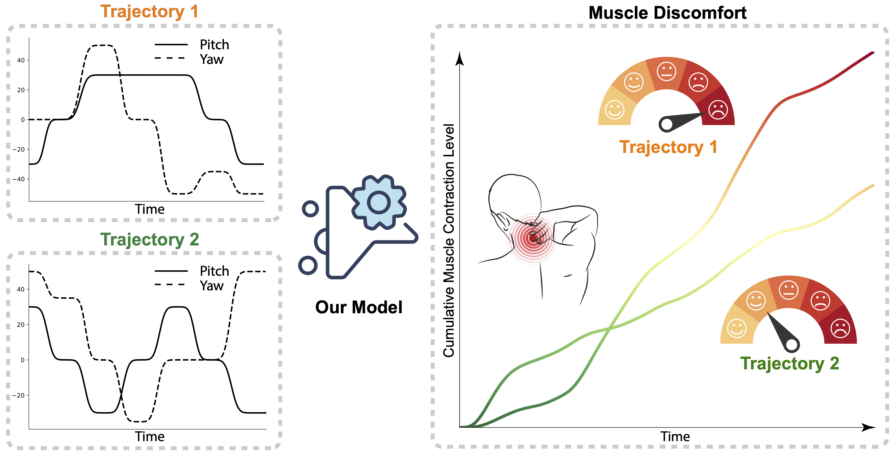

## Toward Optimized VR/AR Ergonomics: Modeling and Predicting User Neck Muscle Contraction (SIGGRAPH 2023)

[Yunxiang Zhang](https://yunxiangzhang.github.io/), [Kenneth Chen](https://kenchen10.github.io/), [Qi Sun](https://qisun.me/)

[\[Paper\]](https://www.immersivecomputinglab.org/wp-content/uploads/2023/05/xr-ergonomics-neck-comfort.pdf) [\[Project Page\]](https://www.immersivecomputinglab.org/publication/toward-optimized-vr-ar-ergonomics-modeling-and-predicting-user-neck-muscle-contraction/) [\[Video\]](https://www.youtube.com/watch?v=XO8VR1tJoaI)

<p float="left">
  
  
</p>

Ergonomic efficiency is essential to the mass and prolonged adoption of VR/AR experiences. While VR/AR head-mounted displays unlock users’ natural wide-range head movements during viewing, their neck muscle comfort is inevitably compromised by the added hardware weight. Unfortunately, little quantitative knowledge for understanding and addressing such an issue is available so far.

Leveraging electromyography devices, we measure, model, and predict VR users’ neck muscle contraction levels (MCL) while they move their heads to interact with the virtual environment. Specifically, by learning from collected physiological data, we develop a bio-physically inspired computational model to predict neck MCL under diverse head kinematic states. Beyond quantifying the cumulative MCL of completed head movements, our model can also predict potential MCL requirements with target head poses only. A series of objective evaluations and user studies demonstrate its prediction accuracy and generality, as well as its ability in reducing users’ neck discomfort by optimizing the layout of visual targets. We hope this research will motivate new ergonomic-centered designs for VR/AR and interactive graphics applications.

## Usage

1. Download the dataset at [OneDrive](https://1drv.ms/f/s!Ahl4AorfaIk6kP1fu47JkKarPTepug?e=6kUopa);
2. Place the extracted `Data/` folder under the project root directory;
3. Move into the MCL-Estimation subfolder: `cd MCL-Estimation`;
4. Train and evaluate MCLNet: `python main.py`.

For more details about our model and dataset, please refer to [our paper](https://www.immersivecomputinglab.org/wp-content/uploads/2023/05/xr-ergonomics-neck-comfort.pdf).

## Citation

If you find this work useful for your research, please consider citing [BibTeX](Docs/xr-ergonomics-neck-comfort.bib):

```bibtex
@inproceedings{zhang2023toward,
  title={Toward Optimized VR/AR Ergonomics: Modeling and Predicting User Neck Muscle Contraction},
  author={Zhang, Yunxiang and Chen, Kenneth and Sun, Qi},
  booktitle={ACM SIGGRAPH 2023 Conference Proceedings},
  pages={1--12},
  year={2023}
}
```